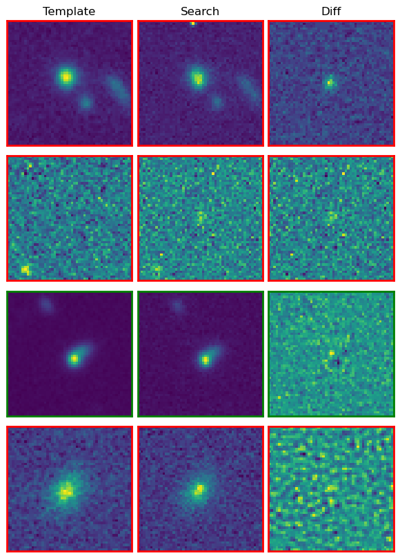
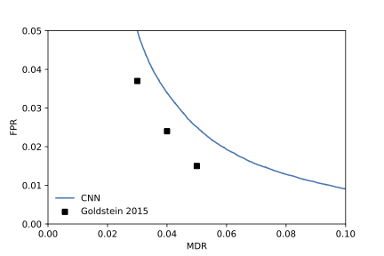

# fairuniverse 

## Cosmology Challenge Description

Cosmologists use supernovae to infer the rate at which the Universe is expanding. Discovering new supernovae will allow us to better constrain this measurement, as well as explore the emerging internal conflicts within the standard model of cosmology. 

In this challenge, users will use data from the Dark Energy Survey (DES) to design a machine learning model for the automatic detection of new supernovae in DES data. 

## Description of the data 

The data in this challenge was first collated for classification tasks for use in the DES supernova transient detection pipeline in [Goldstein et al 2015](https://arxiv.org/abs/1504.02936), and was subsequently updated in [Ayyar et al (2022)](https://arxiv.org/abs/2203.09908). Each example of the dataset consists of three images, centered on a candidate source. This source may either be an astrophysical transient of scientific interest, or an artifcat produced by the pipeline (e.g. imperfect differencing of a foreground star, imperfect beam modeling, imprecise astrometry leading to off-centered differencing). 

There are 898,693 independent samples, each consisting three 51x51 pixel images ("search", "template", and "difference"), and have an associated label of either 1 (artifact) or 0 (non-artifact). Below is a plot of three independent data points, one on each row, with each image type in a different column. 

## Evaluation

This is a binary classification problem. Each triplet of images can be characterized as an artifcat (true) or a non-artifact (false). The classifier is scored by the AUC metric. 

## Extensions

- The "real" point sources in this dataset were generated by injecting simulated sources into difference maps. When the trained model was used for inference for real DECam data, it had a missed detection rate of ~50%. Using an additional expert-labelled dataset to improve the base model, Graham et al 2023 were able to reduce the missed detection rate to ~5%. 
- The requirement of expert labellers means that we are likely to miss the rare, brighter events, which will not be well-represented in the training data, and may be missed by the base simulation-trained algorithm. It was shown in Ayyar et al 2022, that even higher S/N images from the raw DECam dataset were missed by the simulation-trained algorithm. 
- Systematically missing out rare, brighter, sources can lead to biases in the cosmology constraints derived from these supernova detections. 
- How can we frame a challenge to address this shortcoming? 
